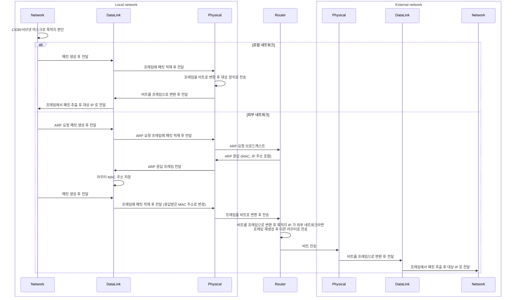

## OSI 7계층

### 1. Physical 계층
- 전송 단위: Bits (전압, 주파수 등)
- 전송 장치: 케이블, 안테나, 모뎀 등
- 전송 대상: 연결된 모든 장치 (브로드캐스트)
- 허브(L1)가 받은 신호를 그대로 연결된 장치에 브로드캐스트
- Physical 계층에서는 여러 장치의 동시 전송 시 발생하는 충돌 처리 불가

### 2. Data link 계층
- 전송 단위: Frame (동기화 비트열, 프레임 시작, 목적/출발지 주소, 데이터 길이, 데이터, 오류검사필드)
- 전송 장치: 스위치 (L2), AP (Access Point) 등
- 전송 대상: 전송받을 장치 (유니캐스트)
- Physical 계층에서 전달받은 통신을 제어하여 장치 간의 통신을 안정화
- MAC 주소를 통한 장치 식별
- 스위치에서 CSMA/CD 와 같은 프로토콜을 통해 충돌 방지/감지하고 충돌 시 프레임 임시 저장 및 전송
- Data link 계층에서는 외부 네트워크 통신 처리 불가

### 3. Network 계층
- 전송 단위: Packet (출발/목적지 IP, 데이터, TTL 등)
- 전송 장치: 라우터, 스위치(L3)
- 전송 대상: 외부 네트워크 ('Inter net'work)
- 여러 로컬 네트워크 노드들을 거쳐서 목적지까지 도달하기 위한 프로토콜
- IP 주소를 통한 네트워크 식별
    ```text
    로컬 네트워크인지 외부 네트워크인지 판단
    
    CIDR Notation: IP 주소 집합
        192.168.1.0/24 인 경우 24비트(192.168.1) 고정, 8비트(0) 변경 가능
        11000000.10101000.00000010.00000000/24
        |-------------------------| 24비트 (네트워크 비트)
                                  |-------| 8비트 (호스트 주소)
    
    Subnet mask: 호스트/네트워크 비트 구분을 위한 마스크이며 IP 주소와 AND 연산
        IP 주소가 192.168.1.0, 서브넷 마스크가 255.255.255.0 인 경우
        11000000.10101000.00000010.01111101 (IP 주소)
        11111111.11111111.11111111.00000000 (서브넷 마스크/24)
        11000000.10101000.00000010.01111101 (AND 연산 결과 = 192.168.2.0)
    ```
- 로컬 네트워크가 아니라면 라우터로 패킷을 전송하고 라우터는 패킷을 프레임에 적재
- 프레임은 MAC 주소를 통해 전달하여야 하므로 ARP (Address Resolution Protocol)를 통해 IP 로 MAC 주소를 검색
  ```text
  ARP 동작 방식
    
  브로드캐스트 (FF:FF:FF:FF:FF:FF)로 연결된 외부 네트워크로 IP 요청
  해당하는 IP를 가진 네트워크에서 IP 주소 보유 응답 전송
  응답 받은 IP 주소를 기반으로 MAC 주소를 저장 (캐싱?)
  ```
- 라우터는 라우트 테이블을 통해 최적의 노드를 경유하여 목적지로 전송
- Network 계층에서는 여러 어플리케이션의 동시 통신 처리, 패킷 순서 보장 불가

### 1~3. 네트워크 간 통신

