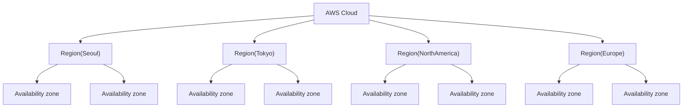

## AWS

### 1. 구조
- Region (지역)
  - AWS 서비스가 제공되는 물리적 위치, Region 별로 서비스나 설정이 다름
  - Region 고유 코드: ap-northeast-1 와 같은 리전 별 코드
  - Region 선택 시 고려 사항
    ```text
    - 지연 속도
    - 법률(데이터, 서비스 제공 관련)
    - 사용 가능 서비스 (us-east-1 의 경우 모든 서비스가 최초로 서비스됨)
    ```

- Availability zone (가용 영역)
  - Region 내에 있는 각각의 물리적인 데이터 센터
  - 1개의 Region 은 2개 이상의 Availability zone 으로 구성


- Edge location
  - 사용자와 가까운 위치에서 콘텐츠 제공, 네트워크 트래픽 처리
  - 정적 파일을 사용자와 가까운 곳에서 빠르게 제공 (캐싱)
  - 원본 서버보다 사용자와 가까우므로 지연 시간 감소
  - 대규모 트래픽이 생길 경우 원본 서버의 부하 감소



### 2. 서비스
- 글로벌 서비스
  - 데이터, 서비스를 전 세계에서 공유
  - IAM(접근 제어 서비스), Route53(DNS), WAF(웹 애플리케이션 방화벽) 등
  

- 지역 서비스
  - 특정 리전을 기반으로 데이터, 서비스를 제공
  - 대부분의 서비스가 지역 서비스에 해당됨
  - 리전 전체의 가용 영역 또는 하나의 가용 영역에서만 서비스

### 3. ARN (Amazon Resource Names)
- AWS 의 모든 리소스에 부여되는 고유 아이디
    ```text
    arn:[partition]:[service]:[region]:[account_id]:[resource_type]/resource_name/(qualifier)
    ```
  