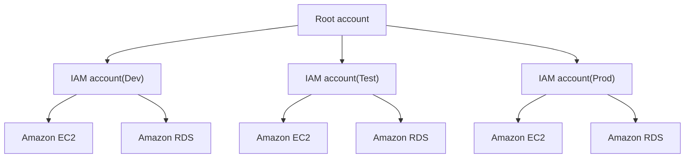

## AWS 계정

### 1. Root 사용자
- 계정 생성 시 같이 생성되는 사용자
- 모든 권한을 보유하고 있으므로 MFA 설정 필수
- 되도록 Root 사용자가 아닌 IAM 사용자를 이용

- Root 사용자만 가능한 작업
  - AWS 계정 설정 변경 (이메일, 계정명, 연락처 등)
  - AWS 계정 삭제
  - 요금 관련 설정 (IAM 사용자에게 위임 가능)
  - AWS 지원 플랜 구독, 변경, 취소

### 2. IAM(Identify and Access Management) 사용자
- IAM 을 통해 생성한 사용자
- 생성 시 권한이 부여되어 있지 않고, 정책/그룹을 통해 별도 권한을 부여

### 3. 환경별 계정 사용 방식

### 4. 사용자 생성 시 필수 작업
- Root 사용자
  - MFA 설정
  - 계정 별칭 설정
  - 예산 알림 설정

- IAM 사용자
  - MFA 설정
  - 권한 또는 권한 그룹 설정
  - 빌링 설정 (빌링 관련 항목이 필요한 경우)